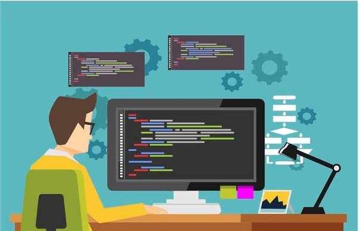

<!-- ### Hi there 👋  I'm Samsheer Alam, a results-driven software engineer with over 4 years of experience.
### My expertise extends across the full stack, encompassing React and Node.js technologies, and I have a solid foundation in cloud computing with AWS. My career has been marked by consistent contributions to successful projects, and I am passionate about crafting innovative solutions, optimizing performance, and delivering high-quality software that drives business success. -->

<table>
  <tr>
    <td>
      

        Hi there 👋  I'm Samsheer Alam
      

      

        a results-driven software engineer with over 4 years of experience. My expertise extends across the full stack, encompassing React and Node.js technologies, and I have a solid foundation in cloud computing with AWS. My career has been marked by consistent contributions to successful projects, and I am passionate about crafting innovative solutions, optimizing performance, and delivering high-quality software that drives business success.
      

    </td>
    <td>
      
    </td>
  </tr>
</table>
<!--
**Samsheer-alam/Samsheer-alam** is a ✨ _special_ ✨ repository because its `README.md` (this file) appears on your GitHub profile.

Here are some ideas to get you started:

- 🔭 I’m currently working on ...
- 🌱 I’m currently learning ...
- 👯 I’m looking to collaborate on ...
- 🤔 I’m looking for help with ...
- 💬 Ask me about ...
- 📫 How to reach me: ...
- 😄 Pronouns: ...
- ⚡ Fun fact: ...
-->

